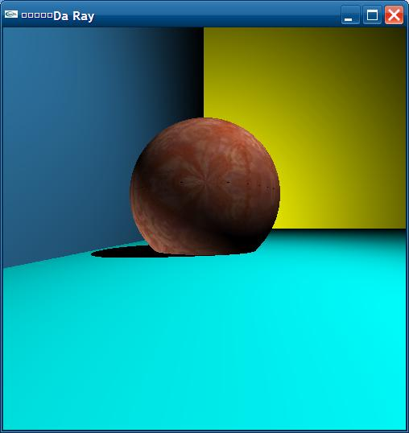

DaRay
=====

A simple Ray Tracer.(Uses glm for the math)

1) Builds on Linux -> Makefile provided.  
2) A VisualStudio 2010 solution attached as well.  

The following features are currently available:
1) Ray-Plane and Sphere intersections  
2) Shadows
3) Textures
4) Lighting(No specular yet)
5) MultiThreaded.(provided C++11 support is present)

